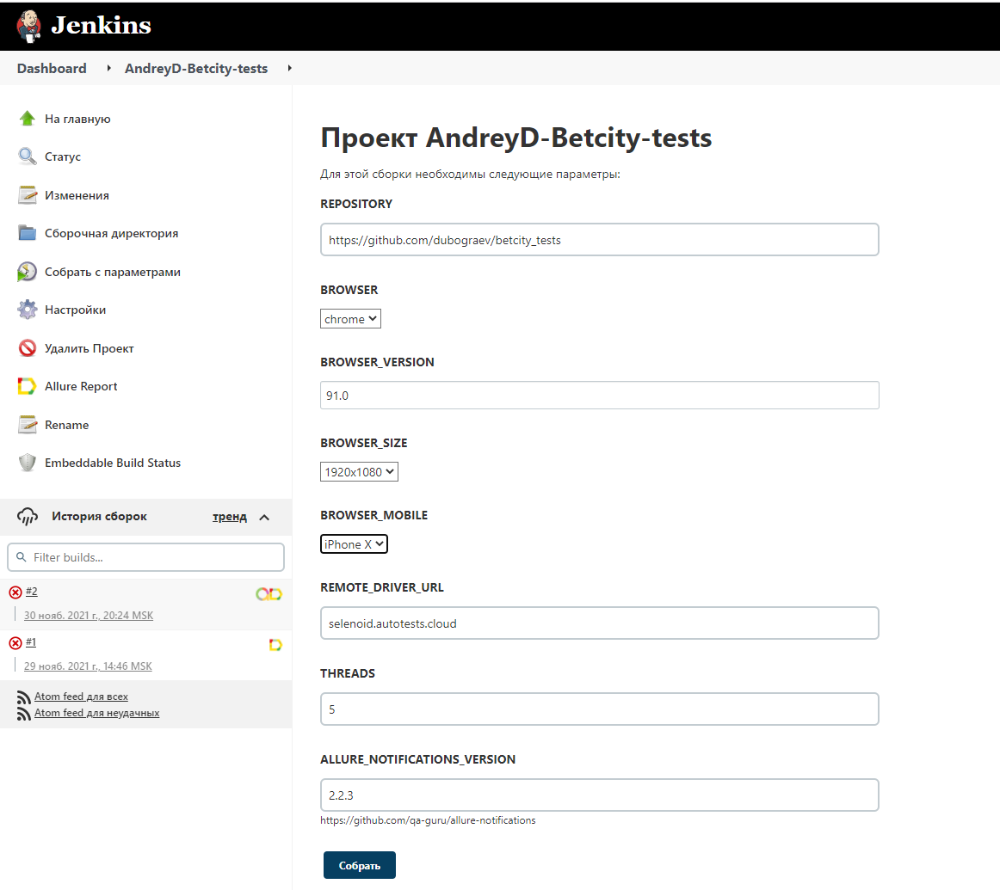
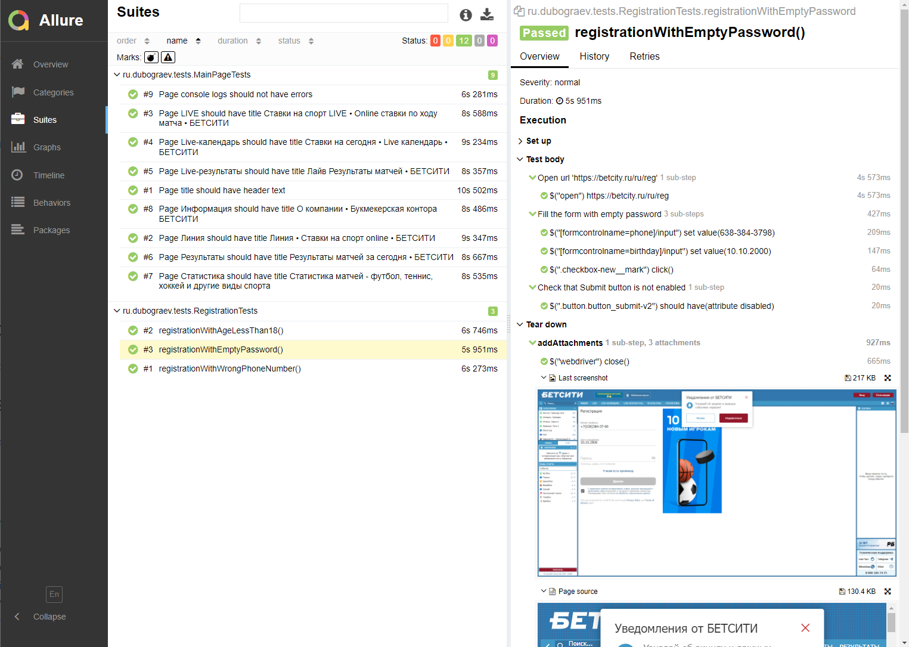
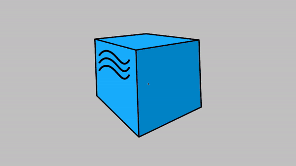
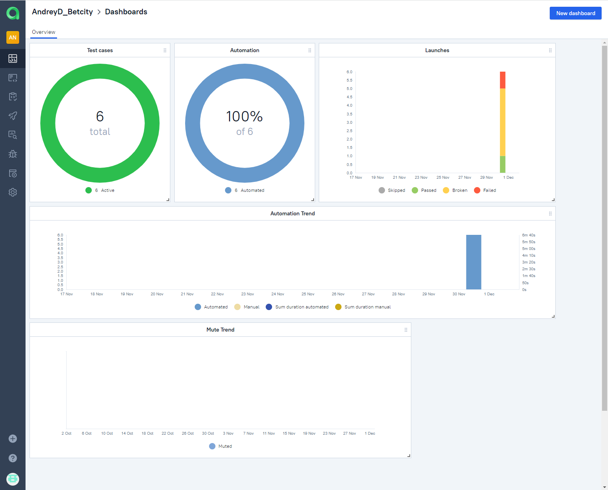
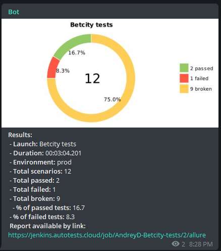

# UI tests for Betcity.ru

## Technology Stack


This project has written in [Java](https://go.java/) using [Selenide](https://selenide.org/) framework for UI-tests
and [REST-Assured](https://rest-assured.io/) for API-test. [Gradle](https://gradle.org/) is used to build the project.
[JUnit 5](https://junit.org/junit5/) is used as a unit-testing framework. [Allure Report](http://allure.qatools.ru/),
[Allure TestOps](https://docs.qameta.io/allure-testops/), [Jira](https://www.atlassian.com/software/jira) and
[Telegram Bot](https://github.com/qa-guru/allure-notifications) are used to visualize test results. Tests are launched
from [Jenkins](https://github.com/EIOmelyashchik/qa_guru_final_project/blob/master). [Selenoid](https://aerokube.com/selenoid/)
is used to run browsers in [Docker containers](https://www.docker.com/resources/what-container).


## Description
You can run tests by configuring the following parameters:
- browser (chrome is by default)
- browserVersion (89.0 is by default)
- browserSize (1920x1080 is by default)
- browserMobileView (mobile device name, for example iPhone X)
- remoteDriverUrl (url address from selenoid or grid)
- videoStorage (url address where you should get video)
- threads (number of threads)



#### To run tests locally (default):
`gradle clean test`

#### To run tests on Selenoid:
```
gradle clean test
  -Dweb.remote.driver.url=selenoid.autotests.cloud
  -Dweb.remote.driver.user={USER}
  -Dweb.remote.driver.password={PASSWORD}
    * -Dweb.browser={BROWSER}
    * -Dweb.browser.version={BROWSER_VERSION}
    * -Dweb.browser.size={BROWSER_SIZE}
    * -Dthreads={THREADS_AMOUNT}
```
*optional

## Allure Report


#### Test with steps, attached image, console logs and video:


#### The video of the test:


## Allure TestOps
#### Launches


#### Test cases


## Telegram bot will show whether smth is broken


## Jira integration

